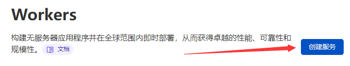
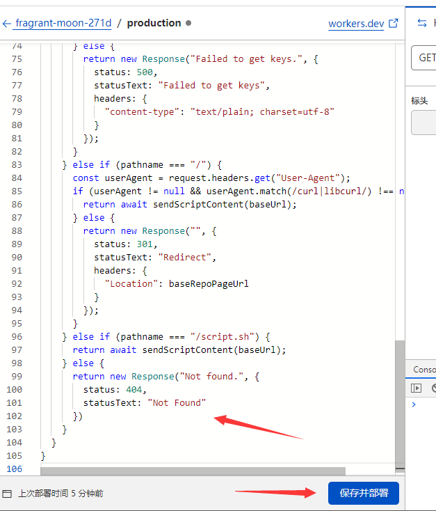
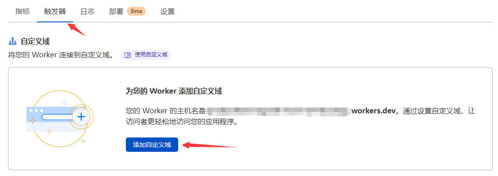
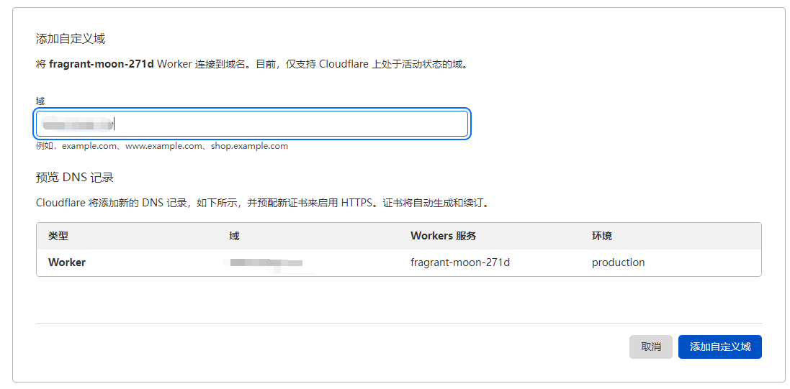
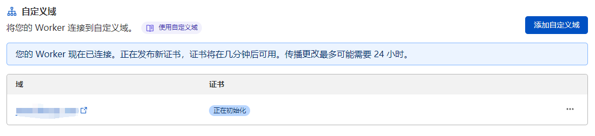

# Quickly Configuring SSH Server
快速地将 SSH 密钥部署到服务器中，并定期更新。

这个脚本可以帮你做到这些事情：
- 快速配置服务器的 SSH Server；
- 定期自动更新 SSH 公钥到服务器中；
- 集中管理注册到服务器的 SSH 公钥（例如使用 Github 管理 SSH 公钥）；

## Quick Usage
部署密钥并设置定期更新：
```bash
curl -s https://ssh.lamgc.me | bash -s -- -c
```
如果不希望自动更新密钥，可以移除 `-c` 参数：
```bash
curl -s https://ssh.lamgc.me | bash -s
```
跳过检查 SSH Server，只需要安装秘钥的话，就需要单独使用 `-o` 参数：
```bash
curl -s https://ssh.lamgc.me | bash -s -- -o
```
添加 `-p yes` 参数可以设置允许 Root 用户使用密码登录 SSH（需使用 Root 用户执行脚本）：
```bash
curl -s https://ssh.lamgc.me | bash -s -- -p yes
```
要查看脚本的帮助信息，请使用 `-h` 参数：
```bash
curl -s https://ssh.lamgc.me | bash -s -- -h
```

> Note: 更多用法请参见脚本帮助信息~

## Paths
获取 SSH 公钥：
```
https://ssh.lamgc.me/ssh.keys
```

获取 Shell 脚本：
```
https://ssh.lamgc.me/script.sh
```

获取 Shell 脚本（使用 Curl 访问）：
```
https://ssh.lamgc.me/
```

访问本页面（不使用 Curl 访问）：
```
https://ssh.lamgc.me/
```

## Install
### Configuration
先 Fork 本仓库，Fork 后在仓库设置中启用 Github Pages，分支指向 main 分支，目录为仓库根目录。  
配置好后将仓库克隆到本地，然后修改 `cf-worker/src/index.js` 中的前五个变量：
```javascript
// 改成你自己的 Github 用户名，注意是登录 Github 的那个用户名.
const githubUserName = "LamGC";
// 改成你 Fork 后的仓库名，记得要开启 Github Pages 功能.
const githubInstSshProjectName = "quickly-conf-sshd";
// 如果可以，建议在此设置备用的 SSH 公钥, 以防 Github 无法使用.
const backupSshKeys = ``;
// Worker 的访问地址, 如果不填的话默认为请求的地址, 填了就会用这里的地址(要去 Worker 的触发器那绑定, 否则无效).
const defaultBaseUrl = "";
// Cron 表达式, 默认 1 天执行一次更新.
const cronExpression = "0 0 * * *";
```

### Use Wrangler
如果你安装了 Cloudflare 的 Wrangler，可以直接在 `cf-worker` 目录中执行：
```bash
wrangler publish
```
执行后将会自动创建 Worker 并上传 worker js 代码，Worker 的名字是 `quickly-conf-ssh-worker`。  

### Manual Install
如果你没有安装 Wrangler，那就手动在 Cloudflare Workers 中新建一个 Worker，名字你喜欢就好（也可以使用 `quickly-conf-ssh-worker`），选择 HTTP 处理程序，然后下一步；  

  

创建完成后点击 Worker 名称右边的**快速编辑**，将 `cf-worker/src/index.js` 中的内容复制到编辑框中，把原本的代码覆盖掉，然后保存；  


保存后需要访问一下 Worker，检查是否有误（如果不检查仔细，把其他人的 SSH 密钥设置到服务器里了，那就寄咯）：
- 直接访问 Worker 地址，看看是否能跳转到你 Fork 的仓库中（地址栏显示了 `https://{你的 Github 用户名}.github.io/{Fork的仓库名}/`）；
- 访问 `{Worker地址}/ssh.keys`，应该显示你的在 Github 设置了的所有 SSH 公钥，如果是空的或者不是你的密钥，那就检查一下是不是 Github 用户名填错了；
- 访问 `{Worker地址}/script.sh`，应该返回一个脚本，脚本开头的配置应与你在 Worker 开头的有关配置一致。

检查无误后就算安装完成了，然后修改本 Readme 的上面几个部分，把域名都改成自己的，保存后提交 Push 上去就好。  
（如果你不会用 Git，那就直接去 Github 网页上改 Readme.md）

### （可选）使用自定义域名
在 Worker 详情中，点击“触发器”，然后点击“添加自定义域”，按照提示输入已添加在 Cloudflare 中的域名即可。  
  
  

